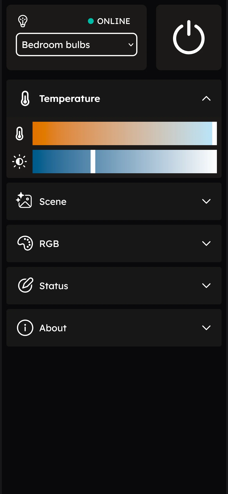
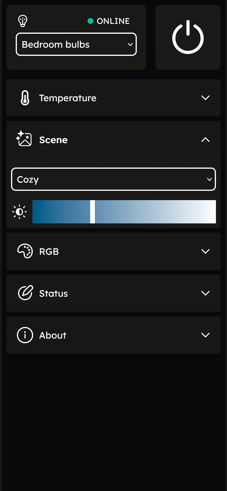
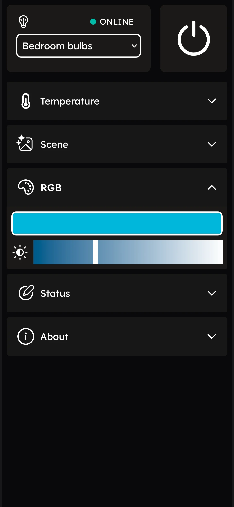

<p align="center">
  
</p>

# WiZ Light'er

This is no nonsense WiZ bulb controller web app based on Flask. Just simple and lightweight, can use it in PC or your mobile devices. No telemetry, no ads, no account. Just click the button to send UDP to the bulb and done.

I make this program because WiZ official app become unreliable, it will take a long time just to connect to my lamp, sometimes it connect but mostly won't. 

When Im doing research for alternative program, I found out that the program actually just sending UDP to the bulb so I just start making this program myself.


[List of WiZ UDP commands by Sean Mcnally](https://seanmcnally.net/wiz-config.html)

### Demo

<p float="center">
  
   
  
</p>

### Alternative
- [pywizlight](https://github.com/sbidy/pywizlight)
- You can use any UDP app in your mobile, and you can just cutomize button with your favorite command. 


### Installation

#### Run as python file
1. Clone or download this repository
2. Run _setup.bat_ to install virtual environtment and install dependencies. _(or do it manually)_
3. Run _run.bat_ to run the program.

#### Run as .exe
1. Download executable in release pages
2. You need to put .exe in it's own folder because it will create config file.
3. You can change port in config.yaml

#### Build your own .exe
1. Clone or download this repository
2. Run _setup.bat_ to install virtual environtment and install dependencies. _(or do it manually)_
3. Open terminal and use compile it using _pyinstaller_
##### With [UPX](https://github.com/upx/upx)
```python
pyinstaller --onefile --noconsole --add-data 'icon.png:.' --add-data 'templates:templates' --add-data 'static:static' --icon=icon.ico --name="WinVol-Network" --clean --upx-dir C:\upx main.py
```

##### Without [UPX](https://github.com/upx/upx)
```python
pyinstaller --onefile --noconsole --add-data 'icon.png:.' --add-data 'templates:templates' --add-data 'static:static' --icon=icon.ico --name="WinVol-Network" --clean main.py
```


### License

WiZ Light'er is released under the [MIT license](./LICENSE).